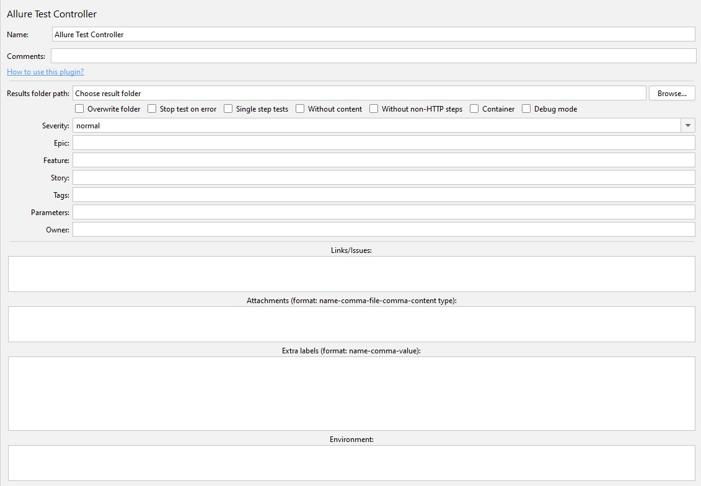
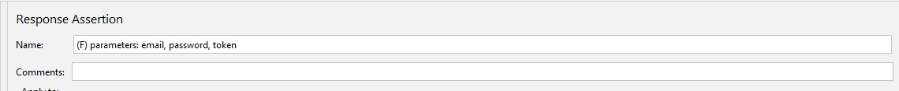
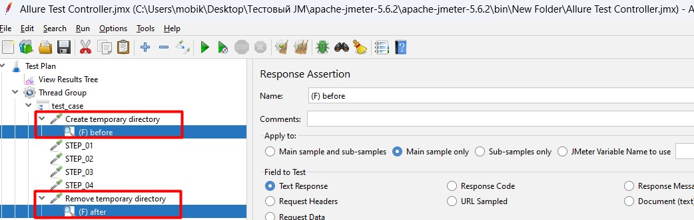
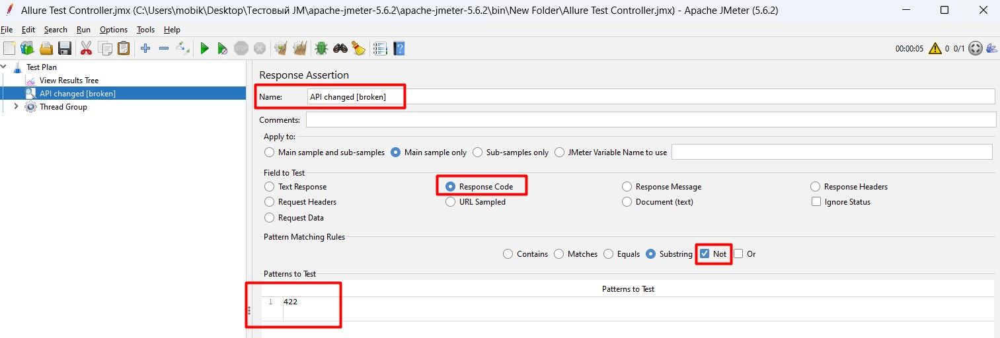
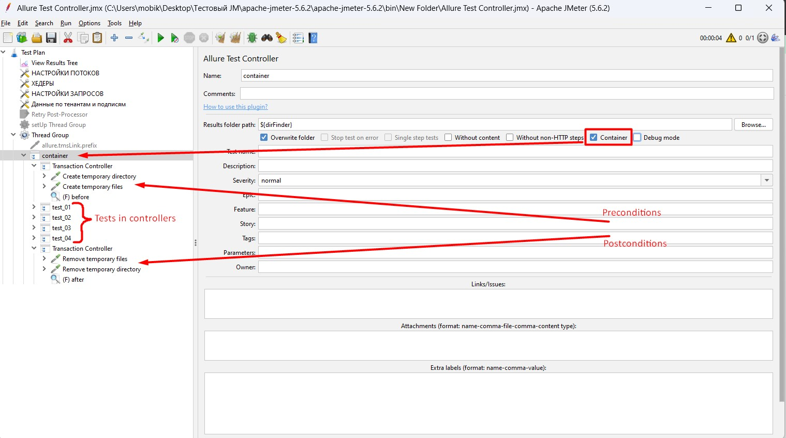

[eng](./README-en.md)

# Allure Test Controller

## Оглавление 
- [Обзор](#обзор)
- [Мотивация](#мотивация)
- [Описание атрибутов контроллера](#описание-атрибутов-контроллера-и-способ-их-применения)
- [Описание дополнительных атрибутов шага](#описание-дополнительных-атрибутов-шагов-теста-и-способ-их-применения)
- [Режим контейнера](#режим-контейнера)
- [Поддержка истории перезапусков](#поддержка-истории-перезапусков)
- [Утверждения](#утверждения)
- [Ограничения](#ограничения)
- [Механика селективного запуска](#механика-селективного-запуска)
- [Как механика селективного запуска влияет на сценарий и отчёт Allure](#как-механика-селективного-запуска-влияет-на-сценарий-и-отчёт-allure)

## Обзор
Этот Apache JMeter плагин представляет контроллер, который содержит в себе один или несколько тест-кейсов, результаты выполнения которых будут представлены в совместимом с Allure формате.  
  
[назад](#оглавление)


## Мотивация
JMeter имеет встроенный гибкий механизм генерации отчётов тестирования. Но его базовых возможностей не хватает для работы с фреймворком Allure Report и TMS, использующими этот инструмент для визуализации отчётов. Данный плагин призван решить эту проблему и предоставить возможность настраивать результаты тестирования под свои нужны в удобном для пользователя интерфейсе и сохранять их в правильном формате.  
[назад](#оглавление)


## Описание атрибутов контроллера и способ их применения:
- **Results folder path**: Указание пути к папке с результатами тестирования. Единственное обязательное для заполнения поле. Для указания пути можно воспользоваться кнопкой "Browse...". ВНИМАНИЕ! Не указывайте здесь конечную папку, а только путь к ней. В указанной директории будет создана папка "allure-results", в которую и будут попадать результаты тестов.
  
- **Overwrite folder**: Если установлен, то папка, указанная по пути из "Results folder path" будет очищена перед выполнением контроллера. Рекомендуется использовать только для первого контроллера внутри Thread Group, если вы используете внутри сценария только одну группу потоков. Если вы используете несколько групп потоков, то использовать чек-бокс следует только перед началом тестирования. Например, внутри SetUp Thread Group.
  
- **Stop test on error**: Если установлен, то останавливает поток, если внутри контроллера любой из сэмплеров выполняется с ошибкой.
  
- **Single step tests**: Если установлен, то изменяет логику формирования результатов: каждый сэмплер внутри контроллера будет считаться отдельным тестом со своим именем и описанием, которые будут браться из названия и описания сэмплера. Остальные поля будут общие для всех тестов в контроллере (серьёзность, эпик и т.д.).
  
- **Without content**: Если установлен, то для шагов теста в отчёте больше не будут формироваться приложенные файлы с деталями запроса и ответа. ВНИМАНИЕ! Если установлен чек-бокс "Stop test on error", то для шага с ошибкой приложенные файлы всё равно сформируются, чтобы можно было посмотреть причину ошибки.
  
- **Without non-HTTP steps**: Если установлен, то в шаги тест-кейса перестанут попадать все НЕ HTTP сэмплеры (например, JSR223 Sampler или Debug Sampler). ВНИМАНИЕ! Если установлен чек-бокс "Stop test on error", то даже если первым сэмплером с ошибкой (на котором поток остановится) станет НЕ HTTP сэмплер, то для него всё равно будет создан шаг, чтобы показать в отчёте причину остановки теста.
  
- **Container**: Переключает контроллер в режим контейнера для указания предусловий и/или постусловий для целого сценария или группы тестов. [Подробнее](#режим-контейнера)
  
- **Debug mode**: Если установлен, то в отчёте ничего не поменяется, но файл .json с результатами теста приобретёт читабельный вид. Функция нужна только для ручной проверки результатов.
  
- **Test name + Description**: Название тест-кейса и его описание. Если установлен чек-бокс "Single step tests", то эти поля становятся недоступными для заполнения, потому что тогда у каждого сэмплера внутри контроллера будут свои название и описание. ВНИМАНИЕ! Поле "Test name" также при необходимости может содержать id связанного кейса при использовании Allure TMS. Для указания связи необходимо перед названием теста указать цифровой id кейса из TMS, после него тире и уже потом название кейса (например, "1425 - Авторизация с персональным аккаунтом"). Функционаьность также работает при использовании чек-бокса "Single step tests".
  
- **Severity**: Указание серьёзности тест-кейса. По умолчанию в Allure доступны варианты: "trivial", "minor", "normal", "critical" и "blocker". Доступен свободный ввод. Если оставить поле пустым, то будет указано "normal".
  
- **Epic + Feature + Story**: Наименования соответствующих сущностей. Служат для разделения тест-кейсов в отчёте по функционалу. Данные поля поддерживают только по одному лейблу, но Allure TMS (например, TestOps) может поддерживать по несколько данных сущностей. В этом случае остальные либо все можно перечислить в поле "Extra labels".
  
- **Tags**: Указание тегов к тест-кейсу. Каждый новый тег указывается через запятую.
  
- **Parameters**: Указание переменных, которые нужно отразить в тест-кейсе. Заполняется именами переменных через запятую, без "${}". ВНИМАНИЕ! Если установлен чек-бокс "Single step tests", то для переменных будут браться те значения, которые они имеют после выполнения текущего сэмплера. Если чек-бокс "Single step tests" не установлен, то для переменных будут браться значения, которые они имеют до начала работы контроллера.

- **Owner**: Указание создателя тест-кейса либо ответственного за его актуальность.
  
- **Links**: Указание ссылок к тест-кейсу. Каждая ссылка должна начинаться с новой строки и соответствовать формату, иначе будет проигнорирована. Есть 2 способа указать ссылку:
    1. Указать в формате "Имя -> запятая -> URL". Подходит для всех случаев;
    2. Указать в формате "URL". В этом случае часть ссылки после последней косой черты становится именем ссылки. Подходит только для случаев, когда эндпоинт должен являться именем. Например, при указании в строке "https://example.com/tms/TMS-112" именем ссылки автоматически станет "TMS-112".
  
- **TMS Links**: Эта функциональность добавлена исключительно для удобства при использовании помимо Allure внешней TMS. Для добавления данной ссылки необходимо указать свойство JMeter "allure.tmsLink.prefix" в файле .properties либо определить в сценарии при помощи сэмплера, поддерживающего ввод кода (например, BeanShell Sampler). После этого в поле "Links" можно просто указывать наименование сущности, чтобы плагин автоматически добавил к нему ссылку из свойства как префикс. Например, при "allure.tmsLink.prefix" = "https://example.com/tms/" и указании в строке "TMS-112", к тест-кейсу добавится ссылка с именем "TMS-112" и URL = "https://example.com/tms/TMS-112". ВНИМАНИЕ! Для более гибкой настройки можно указывать в свойстве не полный путь, а только его неизменяемую часть, и в строку записывать остальное. Например, при "allure.tmsLink.prefix" = "https://example.com/" и указании в строке "some/path/to/use/TMS-112", к тест-кейсу добавится ссылка с именем "TMS-112" и URL = "https://example.com/some/path/to/use/TMS-112".

- **Issues**:  Любую ссылку, вписанную в поле "Links", можно пометить как ссылку на дефект. Для этого достаточно в начале строки указать "(I)" и после этого ввести ссылку в любом допустимом формате. Данная функция носит исключительно визуальный характер в отчёте: указанная ссылка будет помечена иконкой "баг".

- **Attachments (format: name-comma-file-comma-content type)**: Указание вложений к тест-кейсу в формате "Имя вложения в отчёте -> запятая -> файл вложения -> запятая -> тип файла вложения". Каждое вложение должно начинаться с новой строки и соответствовать формату, иначе будет проигнорировано. Рекомендации по заполнению:
    1. Обязательно заполняйте все 3 поля для каждого вложения, чтобы избежать ошибок;
    2. В атрибут "Файл вложения" можно прописывать путь к файлу, если его директория отличается от "allure-results". В этом случае папка с результатами является рабочей директорией, относительно которой прописывается путь;
    3. В атрибут "Файл вложения" в конце обязательно должно быть вписано расширение файла (например, "example.jpg"). Исключение: файл без расширения;
    4. В атрибут "Тип файла вложения" вписывается полное содержимое поля "Content-Type". Так для файла "example.jpg" тип файла будет "image/jpg".

- **Extra labels (format: name-comma-value)**: Указание дополнительных атрибутов тест-кейса в формате "Атрибут -> запятая -> значение атрибута". Каждый лейбл должен начинаться с новой строки и соответствовать формату, иначе будет проигнорирован. ВНИМАНИЕ! При генерации отчёта при помощи консольной утилиты Allure, поддержка специфических дополнительных полей не осуществляется. Такие значения должны поддерживаться и быть настроенными в вашей Allure TMS, чтобы быть видимыми в отчёте.

- **Environment**:  Данное поле позволяет добавить к прогону данные о тестовом окружении. Каждый элемент окружения вписывается с новой строки в формате "Атрибут = значение". ВНИМАНИЕ! Если в нескольких контроллерах заполнено данное поле, то в отчёт попадёт тестовое окружение из последнего выполненного тест-кейса, в котором это поле заполнено.

[назад](#оглавление)


## Описание дополнительных атрибутов шагов теста и способ их применения:
Плагин также поддерживает дополнительные атрибуты шага, реализуемые за рамками контроллера, отдельно для каждого шага. Чтобы добавить дополнительный атрибут, необходимо добавить в шаг утверждение типа "Response Assertion". Оставьте в нём все поля пустыми, кроме "Name". Данное поле должно начинаться с "(F) ...". Какие атрибуты поддерживает плагин:

- **Step parameters**: Поле "Name" утверждения должно начинаться с "(F) parameters: " (обязательно в таком регистре), а после двоеточия перечислите через запятую имена всех переменных, значения которых хотите вывести для этого шага в отчёте, без "${}". ВНИМАНИЕ! Все параметры должны быть вписаны в один и тот же Response Assertion. Если у нескольких элементов в одном и том же шаге название будет начинаться с "(F) parameters: ", то в отчёт попадут только параметры из того элемента, который расположен в дереве элементов ниже, остальные будут проигнорированы. Важно помнить, что параметры теста определяются значением переменных на момент непосредственно перед входом в контроллер, а параметры шага - сразу после окончания выполнения данного шага. То есть если в вашем шаге используется любой экстрактор, который создаёт новую переменную, вы сразу же можете вывести её в параметрах этого шага.  
  

- **Step attachments**: Поле "Name" утверждения должно начинаться с "(F) attach: " (обязательно в таком регистре), а после двоеточия укажите одно вложение в формате, аналогичном формату атрибута контроллера "Attachments". Например, поле "Name" может выглядеть следующим образом: "(F) attach: Скриншот 1, Screenshot_1.png, image/png". В случае с данным атрибутом к каждому шагу можно добавить сколько угодно утверждений с вложениями - они все попадут в отчёт.  
  

- **Preconditions/Postconditions**: Поле "Name" утверждения должно начинаться с "(F) before" или "(F) after" (обязательно в таком регистре) для указания, что данный шаг является предусловием или постусловием соответственно. ВНИМАНИЕ! Данные типы шагов НЕ входят в тело теста и не влияют на результат его прохождения. То есть, если при выполнении теста все возникшие ошибки только в шагах, помеченных как предусловие/постусловие, то сам тест считается успешно выполненным. Также важно, что если первый сэмплер внутри контроллера не был помечен как предусловие, то в последующих шагах это объявление будет игнорироваться - предусловия можно указать только в начале теста. После первого шага, помеченного как постусловие, все последующие шаги до конца теста автоматически будут помечаться как постусловия независимо от наличия объявления - постусловия при указании должны завершать тест.  
  

- **Assertion failure status**: По умолчанию любое проваленное утверждение меняет статус соответствующего шага/теста в отчёте на "failed". Если у вас есть необходимость в случае провала проверки использовать другой статус, то можно прямо указать, какой статус использовать. Для этого поле "Name" утверждения НЕ должно начинаться с "(F)", но должно заканчиваться на "\[broken\]" или "\[unknown\]". Это будет означать, что если данное утверждение является первым проваленным для данного шага, то статус шага изменится на указанный. Если при этом оно же будет и первым проваленным в рамках теста, то весь тест-кейс также получит данный статус. ВНИМАНИЕ! Статус утверждения при этом не изменится - оно может быть либо верным (passed), либо ложным (failed). Возможный сценарий использования: если мы допускаем, что любая ошибка 422 может быть связана только с изменениями в API проекта, то любой тест с такой ошибкой можно считать сломанным, так как он нуждается в соответствующей доработке. Тогда утверждение с проверкой на данный статус-код можно поместить сразу в тест-план или группу потоков и настроить следующим образом:  


[назад](#оглавление)


## Режим контейнера
В случае, если в интерфейсе контроллера включен чек-бокс "Container", данный контроллер переходит в режим контейнера. Для чего это нужно? По умолчанию использование предусловий и постусловий распространяется на каждый отдельный контроллер. При включение данного чек-бокса все тесты внутри контейнера автоматически будут содержать все предусловия и/или постусловия контейнера, а также могут дополнительно иметь свои собственные. То есть внутри контейнера могут быть общие предусловия, потом контроллеры с тестами, потом общие постусловия. Поля в интерфейсе такого контроллера можно не заполнять, только "Results folder path" и доступные чек-боксы по необходимости. Это может выглядеть следующим образом:  
  
**ВНИМАНИЕ!** Стоит учитывать следующие особенности работы с контейнером:
1. Внутри контейнера не должно быть Allure Test Controller с включенным чек-боксом "Container". В противном случае шаги одного контейнера перезапишут другой;  
2. Предусловия и постусловия контейнера обозначаются утверждением с полем "Name", начинающимся с "(F) BEFORE" или "(F) AFTER" соответственно. Регистр имеет значение! Аналогичные объявления в нижнем регистре будут игнорироваться контейнером и записываться только в отдельных тестах;  
3. Если внутри любого из тестов внутри контейнера включен чек-бокс "Stop test on error" и в этом тесте произойдёт ошибка либо по любой другой причине работа контроллера не будет завершена, то предусловия к вложенным тестам не будут добавлены, так как поток остановится до того, как файл контейнера будет сформирован;  
4. Чек-боксы "Without content", "Without non-HTTP steps" и "Debug mode" в интерфейсе контейнера распространяются только на его предусловия/постусловия. То есть, если в контейнере включен "Without content", а внутри вложенного в него теста нет, то предусловия и постусловия будут без приложенных файлов с деталями запроса/ответа, а в шагах теста они будут.

[назад](#оглавление)


## Поддержка истории перезапусков
В случае, если вы не очищаете папку "allure-results" после каждого прогона, плагин поддерживает сохранение истории перезапусков того же теста и выводит в отчёт только актуальные результаты для каждого тест-кейса, а результаты предыдущих прогонов хранит в вкладке отчёта "Retries", откуда их можно посмотреть как и любые актуальные результаты. ВНИМАНИЕ! Если вы измените наименование группы потоков либо наименование тест-кейса, то это будет уже другой тест и у него появится собственная история прогонов.

Системы хранения тестов вроде Allure TestOps также делят историчность кейсов по метаданным. Например, если выполнено 4 прогона одного и того же теста и в двух из них выводятся одни "Parameters" и ещё в двух - другие (другие параметры тестов аналогичны), то система разделит историчность этих кейсов на две разных и обе покажет в отчёте.  
[назад](#оглавление)


## Утверждения
Для каждого шага плагин анализирует все вложенные утверждения (assertions) и выводит их в отчёте. Исключение: если поле "Name" утверждения начинается с "(F)", то оно будет проигнорировано, потому что этот флаг используется для объявления дополнительных атрибутов шага. В случае, если хотя бы один из сэмплеров в тест-кейсе завершается с ошибкой, в отчёте в верхней части карточки тест-кейса будет отображаться failure message из первого утверждения, которое не выполнилось. Если в первом сэмплере с ошибкой не будет ни одного утверждения, которое не выполнилось, то failure message останется пустым, а причину ошибки можно будет найти в приложенных к шагу тест-кейса файлах с деталями запроса/ответа.  
[назад](#оглавление)


## Ограничения
1. При записи файлов с данными шага в целях безопасности плагин автоматически подменяет в запросе хедеры "Authorization", "X-Api-Token" и "X-Api-Key" на значение "XXX (Has been replaced for safety)". Подмена не настраивается и происходит всегда.
2. Если вы используете внутри Allure Test Controller какой-либо контроллер цикла (например, While Controller или ForEach Controller), то каждая итерация для сэмплеров внутри цикла будет создавать новые шаги тест-кейса в отчёте. Исключение: если вы используете [Retry Post-Processor](https://github.com/tilln/jmeter-retrier), то шаг будет создан только для последней попытки выполнения сэмплера.
3. Старайтесь не использовать Allure Test Controller внутри такого же контроллера (Исключение: режим контейнера). Если в дочернем контроллере будет установлен чек-бокс "Stop test on error", а в родительском - нет, то в случае ошибки внутри дочернего контроллера в отчёт не попадут результаты родительского, потому что поток будет остановлен до того, как результаты родительского контроллера будут записаны в файл.

[назад](#оглавление)


# Механика селективного запуска

Помимо сохранения отчёта для Allure, плагин также сохраняет результаты выполнения каждого отдельного теста в папку "last-try-results", которая автоматически создаётся там же, где и папка "allure-results". Можно настроить сценарий таким образом, чтобы при запуске он пропускал все тесты, которые в прошлый раз выполнились успешно. 
Настройка осуществляется за счёт свойства JMeter "allure.retry.fallen". Если "allure.retry.fallen" = "true" - сработает механика селективного запуска и повторно будут выполняться только тесты, завершившиеся в последний раз с ошибками.
Данное свойство можно установить несколькими способами:
- **Прописать в файле .properties**: Делать это рекомендуется только в том случае, если вы хотите всегда по умолчанию включать данную опцию ("true").
  
- **Указать в сценарии при помощи сэмплера, поддерживающего ввод кода**: Например, для BeanShell Sampler установка свойства будет выглядеть следующим образом:
```Java
import org.apache.jmeter.util.JMeterUtils;
JMeterUtils.setProperty("allure.retry.fallen", "true");
```

- **Указать при запуске через терминал при помощи параметра -J**:
```
jmeter -Jallure.retry.fallen=true -n -t [your_jmx_file]
```
[назад](#оглавление)


## Как механика селективного запуска влияет на сценарий и отчёт Allure:
1. Если "Single step tests" не установлен, то в случае, если в последний раз хотя бы один шаг теста завершился с ошибкой, в следующий раз весь тест будет выполнен и попадёт в отчёт. Если в последний раз тест завершился успешно, то в этот раз сэмплеры в нём не будут выполняться, а данный тест не попадёт в отчёт.
2. Когда "Single step tests" установлен: если хотя бы один из сэмплеров внутри контроллера в последний раз завершился с ошибкой, то выполняться в сценарии будут все сэмплеры внутри него. В отчёт при этом попадут только тесты, которые в предыдущий раз завершились с ошибкой, и тесты, которые завершились с ошибкой в этот раз. Например, внутри контроллера 5 сэмплеров. Если в предыдущий раз с ошибкой завершился только второй, а после текущего запуска ошибку выдали четвёртый и пятый, то в отчёт попадут 3 теста: 2, 4 и 5. Если в прошлый раз все сэмплеры внутри контроллера завершились успешно - выполнение будет пропущено и в отчёт эти тесты не попадут. ВНИМАНИЕ! Для записи результатов предыдущего запуска теста из одного шага используется уникальное сочетание "Thread Name" + "Sampler Name". Не используйте одинаковые имена сэмплеров внутри контроллера, если установлен "Single step tests", иначе результаты одних тестов будут стирать результаты других.

[назад](#оглавление)
